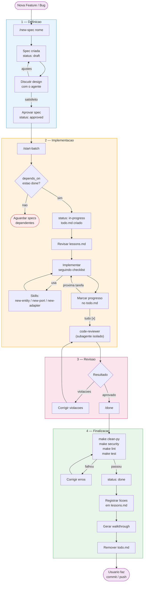

# Guia de Desenvolvimento com IA — Fiscal Guard AI

Este guia documenta o workflow de desenvolvimento do projeto usando Claude Code com **spec-first** e **small batches**.

## Visao Geral do Workflow

O desenvolvimento segue um ciclo disciplinado: nada e implementado sem uma spec aprovada. Cada spec representa no maximo 1 dia de trabalho.



## Estrutura do `.claude/`

```
.claude/
├── CLAUDE.md              # Regras gerais do agente
├── specs/                 # Definicoes de features
│   ├── _template.md       # Template para novas specs
│   └── NNN-nome.md        # Specs numeradas sequencialmente
├── tasks/                 # Gestao de trabalho
│   ├── lessons.md         # Licoes aprendidas (acumulativo)
│   └── todo.md            # Checklist do batch atual (temporario)
├── commands/              # Slash commands
│   ├── new-spec.md        # /new-spec [nome]
│   ├── start-batch.md     # /start-batch [spec]
│   └── done.md            # /done
├── skills/                # Instrucoes step-by-step
│   ├── new-entity.md      # Criar entity de dominio
│   ├── new-port.md        # Criar port (interface ABC)
│   └── new-adapter.md     # Implementar adapter concreto
└── agents/                # Subagentes autonomos
    └── code-reviewer.md   # Revisao contra Clean Architecture
```

| Tipo | O que e | Quando usar |
|------|---------|-------------|
| **Commands** | Slash commands que orquestram o workflow | Iniciar/finalizar etapas |
| **Skills** | Receitas que o agente segue no contexto atual | Criar componentes padronizados |
| **Agents** | Subagentes isolados com contexto fresco | Delegacao de tarefas autonomas |

---

## Passo a Passo Completo

### 1. Criar uma Spec

```
voce: /new-spec postgres event repository
```

O agente cria `.claude/specs/002-postgres-event-repository.md` com o template preenchido:

```markdown
---
id: "002"
title: "Postgres Event Repository"
status: draft
created: 2026-03-28
author: "Tiago"
batch_size: "small"
depends_on: ["001"]
---

# Postgres Event Repository

## Contexto
> O EventRepository port ja existe. Precisamos da implementacao concreta
> usando PostgreSQL para persistir eventos.

## Objetivo
> Criar o adapter PostgresEventRepository, o ORM model EventModel,
> e registrar no container de DI.

## Fora de escopo
- Migrations (Flyway gerencia separadamente)
- Testes de integracao com banco real

## Design

### Camadas afetadas

| Camada | Arquivo | Acao |
|--------|---------|------|
| Infra | `src/infra/database/models/event_model.py` | CREATE |
| Adapter | `src/adapters/outbound/repositories/postgres_event_repository.py` | CREATE |
| Infra | `src/infra/container/container.py` | MODIFY |
| Tests | `tests/unit/adapters/outbound/repositories/test_postgres_event_repository.py` | CREATE |

### Contratos / Interfaces

(interfaces do adapter, conversoes entity <-> model)

## Criterios de aceite

- [ ] EventModel criado com SQLAlchemy
- [ ] PostgresEventRepository implementa EventRepository
- [ ] Conversao _to_entity / _to_model funcionando
- [ ] Registrado no container
- [ ] Testes unitarios com InMemory passando
- [ ] `make lint` passando
- [ ] `make test` passando
```

### 2. Revisar e Aprovar

Discuta o design com o agente. Quando estiver satisfeito:

```
voce: aprovar spec
```

O agente muda `status: draft` para `status: approved`.

### 3. Iniciar o Batch

```
voce: start-batch
```

O agente:
1. Verifica que a spec esta `approved`
2. Verifica que dependencias (`depends_on`) estao `done`
3. Muda a spec para `status: in-progress`
4. Cria `.claude/tasks/todo.md` com checklist granular
5. Revisa `lessons.md` para erros passados relevantes
6. Apresenta o plano e pede confirmacao

Exemplo de `todo.md` gerado:

```markdown
# Batch: 002 — Postgres Event Repository

> Spec: `.claude/specs/002-postgres-event-repository.md`

## Checklist

### ORM Model: `src/infra/database/models/event_model.py`
- [ ] Criar EventModel com colunas: id, url, status, source_type, page, ...
- [ ] Exportar no __init__.py

### Adapter: `src/adapters/outbound/repositories/postgres_event_repository.py`
- [ ] Implementar PostgresEventRepository(EventRepository)
- [ ] Metodo find_by_id
- [ ] Metodo find_pending
- [ ] Metodo save
- [ ] Metodo update_status
- [ ] Conversao _to_entity / _to_model

### Container: `src/infra/container/container.py`
- [ ] Registrar PostgresEventRepository

### Tests
- [ ] Criar InMemoryEventRepository para testes
- [ ] Testar find_by_id, save, find_pending, update_status

### Verificacao
- [ ] `make lint` passando
- [ ] `make test` passando
```

### 4. Implementar

```
voce: pode comecar
```

O agente implementa seguindo o checklist, marcando progresso em `todo.md`. Ele usa **skills** para componentes padronizados:

- **`new-entity`** — cria entity + testes (dataclass pura, sem framework)
- **`new-port`** — cria interface ABC async no dominio
- **`new-adapter`** — cria adapter concreto + schema + registro no container + testes

### 5. Code Review

Antes de fechar, rode o reviewer:

```
voce: code-reviewer
```

O agente delega para um **subagente isolado** que revisa contra Clean Architecture:

```markdown
## Code Review — Batch 002

### Aprovados
- postgres_event_repository.py: imports corretos, herda do port

### Avisos (nao bloqueantes)
- event_model.py:15: considerar adicionar index na coluna status

### Violacoes (bloqueantes)
- (nenhuma)

### Resultado: APROVADO
```

### 6. Finalizar

```
voce: /done
```

O agente:
1. Verifica que todos os itens do `todo.md` estao `[x]`
2. Roda `make clean-py`, `make security`, `make lint`, `make test`
3. Muda a spec para `status: done`
4. Pergunta se houve licoes aprendidas
5. Gera walkthrough das mudancas
6. Remove `todo.md`

---

## Arquitetura Clean — Regras de Dependencia

```
adapters --> domain <-- use_cases
infra --> adapters, domain, use_cases
```

| Camada | Pode importar de | NAO pode importar de |
|--------|-------------------|----------------------|
| `domain/entities/` | stdlib, domain/exceptions | adapters, infra, use_cases |
| `domain/ports/` | domain/entities | adapters, infra, use_cases |
| `use_cases/` | domain (entities + ports) | adapters, infra |
| `adapters/` | domain, infra | use_cases, outros adapters |
| `infra/` | qualquer camada | — |

### Nomenclatura

| Componente | Convencao | Exemplo |
|------------|-----------|---------|
| Entity | PascalCase, sem sufixo | `DownloadConfig`, `UploadFileEvent`, `DownloadUrlEvent` |
| Port (repo) | `{Entity}Repository` | `ConfigRepository`, `UploadFileEventRepository` |
| Port (gateway) | `{Servico}Gateway` | `StorageGateway`, `QueueGateway` |
| Port (client) | `{API}Client` | `TransparenciaClient` |
| Adapter | prefixo de tecnologia | `PostgresConfigRepository`, `PostgresDownloadUrlEventRepository` |
| ORM Model | sufixo `Model` | `DownloadConfigModel`, `DownloadUrlEventModel` |
| Schema | sufixo descritivo | `ConfigDispatchMessage`, `EventMessage` |

---

## Exemplos Praticos por Componente

### Entity (dominio puro)

```python
# src/domain/entities/download_url_event.py
from dataclasses import dataclass
from datetime import datetime

from src.domain.exceptions.domain_exceptions import InvalidEventStatusError

VALID_STATUSES = frozenset({"PENDING", "PROCESSING", "DONE", "FAILED", "REQUEUE"})

@dataclass
class DownloadUrlEvent:
    id: int | None
    config_id: int
    status: str
    page: int
    params: dict
    table_name: str
    total_pages: int | None
    headers: dict
    correlation_id: str
    s3_key: str | None = None
    error_message: str | None = None
    retry_count: int = 0
    processed_at: datetime | None = None
    created_at: datetime | None = None
    updated_at: datetime | None = None

    def __post_init__(self) -> None:
        if self.status not in VALID_STATUSES:
            raise InvalidEventStatusError(f"Invalid status '{self.status}'")

    @property
    def is_pending(self) -> bool:
        return self.status == "PENDING"

    @property
    def has_next_page(self) -> bool:
        return self.total_pages is None or self.page < self.total_pages

    def next_page_event(self) -> "DownloadUrlEvent":
        return DownloadUrlEvent(
            id=None, config_id=self.config_id, status="PENDING",
            page=self.page + 1, params=self.params, table_name=self.table_name,
            total_pages=self.total_pages, headers=self.headers,
            correlation_id=self.correlation_id,
        )

    def mark_processing(self) -> None:
        self._transition_to("PROCESSING")
```

**Regras:**
- `@dataclass`, nunca Pydantic
- Validacoes no `__post_init__`
- Logica de negocio como metodos
- Zero imports de frameworks

### Port (interface abstrata)

```python
# src/domain/ports/outbound/download_url_event_repository.py
from abc import ABC, abstractmethod
from src.domain.entities.download_url_event import DownloadUrlEvent


class DownloadUrlEventRepository(ABC):
    @abstractmethod
    async def find_by_id(self, id: int) -> DownloadUrlEvent | None: ...

    @abstractmethod
    async def find_pending(self) -> list[DownloadUrlEvent]: ...

    @abstractmethod
    async def save(self, event: DownloadUrlEvent) -> None: ...

    @abstractmethod
    async def update_status(self, id: int, status: str) -> None: ...
```

**Regras:**
- `ABC` + `@abstractmethod`
- Sempre async
- Parametros e retornos sao entities do dominio

### Adapter (implementacao concreta)

```python
# src/adapters/outbound/repositories/postgres_download_url_event_repository.py
from src.domain.entities.download_url_event import DownloadUrlEvent
from src.domain.ports.outbound.download_url_event_repository import DownloadUrlEventRepository
from src.infra.database.models.download_url_event_model import DownloadUrlEventModel


class PostgresDownloadUrlEventRepository(DownloadUrlEventRepository):
    def __init__(self, session_factory):
        self._session_factory = session_factory

    async def find_by_id(self, id: int) -> DownloadUrlEvent | None:
        async with self._session_factory() as session:
            model = await session.get(DownloadUrlEventModel, id)
            return self._to_entity(model) if model else None

    async def save(self, event: DownloadUrlEvent) -> None:
        async with self._session_factory() as session:
            session.add(self._to_model(event))
            await session.commit()

    def _to_entity(self, model: DownloadUrlEventModel) -> DownloadUrlEvent:
        return DownloadUrlEvent(
            id=model.download_url_event_id, config_id=model.download_config_id,
            status=model.status, page=model.page, params=model.params,
            table_name=model.table_name, total_pages=model.total_pages,
            headers=model.headers, correlation_id=model.correlation_id,
            s3_key=model.s3_key, error_message=model.error_message,
            retry_count=model.retry_count,
        )

    def _to_model(self, entity: DownloadUrlEvent) -> DownloadUrlEventModel:
        return DownloadUrlEventModel(
            download_config_id=entity.config_id, status=entity.status,
            page=entity.page, params=entity.params, table_name=entity.table_name,
            total_pages=entity.total_pages, headers=entity.headers,
            correlation_id=entity.correlation_id,
        )
```

**Regras:**
- Herda do port
- Dependencias via construtor (DI)
- `_to_entity()` / `_to_model()` para conversao
- Pode importar de `domain/` e `infra/`, nunca de `use_cases/`

### Testes (entity — sem mocks)

```python
# tests/unit/domain/entities/test_download_url_event.py
import pytest
from src.domain.entities.download_url_event import DownloadUrlEvent
from src.domain.exceptions.domain_exceptions import InvalidEventStatusError


class TestDownloadUrlEventCreation:
    def test_create_valid_event(self):
        event = DownloadUrlEvent(
            id=None, config_id=1, status="PENDING", page=1,
            params={}, table_name="contratos_2024", total_pages=None,
            headers={}, correlation_id="abc-123",
        )
        assert event.status == "PENDING"

    def test_invalid_status_raises(self):
        with pytest.raises(InvalidEventStatusError):
            DownloadUrlEvent(
                id=None, config_id=1, status="INVALID", page=1,
                params={}, table_name="contratos_2024", total_pages=None,
                headers={}, correlation_id="abc-123",
            )


class TestPagination:
    def test_has_next_page_when_total_unknown(self):
        event = DownloadUrlEvent(
            id=1, config_id=1, status="DONE", page=3,
            params={}, table_name="contratos_2024", total_pages=None,
            headers={}, correlation_id="abc-123",
        )
        assert event.has_next_page is True

    def test_has_next_page_when_not_last(self):
        event = DownloadUrlEvent(
            id=1, config_id=1, status="DONE", page=2,
            params={}, table_name="contratos_2024", total_pages=5,
            headers={}, correlation_id="abc-123",
        )
        assert event.has_next_page is True

    def test_no_next_page_when_last(self):
        event = DownloadUrlEvent(
            id=1, config_id=1, status="DONE", page=5,
            params={}, table_name="contratos_2024", total_pages=5,
            headers={}, correlation_id="abc-123",
        )
        assert event.has_next_page is False

    def test_next_page_event(self):
        event = DownloadUrlEvent(
            id=1, config_id=1, status="DONE", page=2,
            params={"limit": 100}, table_name="contratos_2024", total_pages=5,
            headers={}, correlation_id="abc-123",
        )
        next_event = event.next_page_event()
        assert next_event.page == 3
        assert next_event.status == "PENDING"
        assert next_event.id is None
        assert next_event.correlation_id == "abc-123"
```

---

## Licoes Aprendidas

O arquivo `.claude/tasks/lessons.md` e acumulativo e nunca e resetado. Sempre que algo der errado durante um batch, o agente registra:

```markdown
## 2026-03-28 — Batch 001

**Erro**: import no final do arquivo para evitar circular dependency
**Causa raiz**: nao havia dependencia circular, foi precaucao desnecessaria
**Regra**: verificar se a dependencia circular realmente existe antes de usar workarounds
```

O agente consulta esse arquivo no inicio de cada batch para evitar repetir erros.

---

## Comandos Uteis

| Comando | O que faz |
|---------|-----------|
| `make lint` | Roda ruff check + format |
| `make test` | Roda pytest com coverage |
| `make security` | Roda bandit (analise de seguranca) |
| `make clean-py` | Remove `__pycache__` e `.pyc` |

---

## Git — Regras

O agente **nunca** executa comandos de escrita no git. Apenas comandos de leitura sao permitidos (`git status`, `git diff`, `git log`). O usuario e responsavel por commits, pushes e merges.
