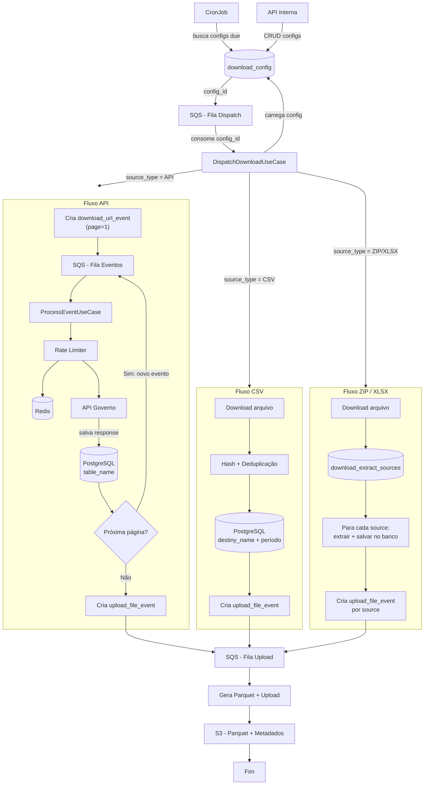
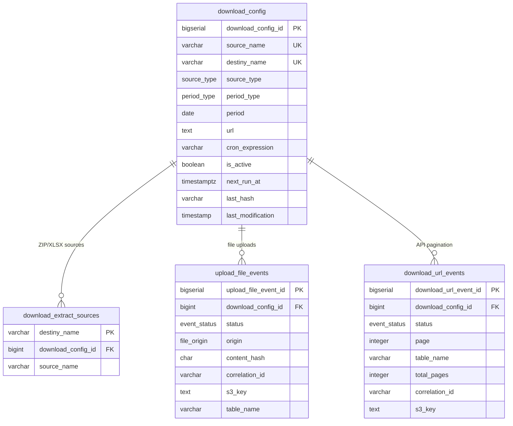

# Visão Geral da Solução

## Sobre o Projeto

Serviço de processamento de dados que consome e processa dados do governo federal, armazenando-os em bases locais através de rotinas automatizadas. Isso possibilita consultas eficientes para análise de dados, controle de qualidade, aplicações frontend e sistemas de IA.

### O que o sistema faz

- Consome e processa dados do governo federal via APIs REST, arquivos CSV, ZIP e XLSX
- Armazena dados em PostgreSQL com organização por período (ano ou mês)
- Exporta para S3 em formato Parquet com metadados
- Controle de duplicatas via hash de 64 bytes e verificação de última modificação
- Processamento paginado com controle de estado (APIs)
- Extração de múltiplos arquivos/abas de fontes ZIP e XLSX
- Rate limiting via Token Bucket (1 req/s público | 700 req/s autenticado)

### O que o sistema NÃO faz

- Alterações nos dados originais
- Disponibilização de APIs públicas sem restrição
- Geração de eventos após armazenamento

## Processos

O serviço é composto por três processos principais:

- **CronJob**: Verifica periodicamente as configurações de download (`download_config`) com execução pendente. Para cada config ativa cujo `next_run_at` foi atingido, publica o `config_id` na fila de dispatch (SQS). Não cria eventos diretamente.

- **Worker**: Consome mensagens de duas filas SQS:
  - **Fila de dispatch** (config): recebe `config_id`, carrega a configuração e roteia por `source_type`:
    - **API**: cria um `download_url_event` (página 1, status PENDING) e publica na fila de eventos. A cada página processada, o worker salva o conteúdo na tabela de destino (`table_name`), verifica se há próxima página e cria novo evento. Quando não há mais páginas, gera Parquet e salva no S3 via `upload_file_events`.
    - **CSV**: faz download do arquivo, gera hash, verifica deduplicação (`last_hash`), salva no banco na tabela de destino (`destiny_name` + período) e cria `upload_file_event` para conversão em Parquet e upload ao S3.
    - **ZIP/XLSX**: faz download do arquivo, consulta `download_extract_sources` para identificar arquivos (ZIP) ou abas (XLSX) a extrair. Para cada source: extrai conteúdo, salva no banco e cria `upload_file_event`.
  - **Fila de eventos**: processa `download_url_events` pendentes (paginação de APIs) e `upload_file_events` pendentes (geração de Parquet e upload S3).

- **API**: Gerencia configurações de download (CRUD), consulta eventos e permite reprocessamento.

## Arquitetura

### Clean Architecture

O projeto segue o padrão **Clean Architecture** em Python, garantindo baixo acoplamento, alta testabilidade e independência de frameworks e infraestrutura.

```
┌─────────────────────────────────────────────────────────────────┐
│                        Infraestrutura                          │
│  (Frameworks, Drivers, DB, Queue, S3, Cache, HTTP clients)     │
│                                                                 │
│  ┌─────────────────────────────────────────────────────────┐   │
│  │                      Adaptadores                        │   │
│  │  (Controllers, Gateways, Repositories, Presenters)      │   │
│  │                                                         │   │
│  │  ┌─────────────────────────────────────────────────┐   │   │
│  │  │               Casos de Uso                      │   │   │
│  │  │  (Regras de negócio da aplicação)               │   │   │
│  │  │                                                 │   │   │
│  │  │  ┌─────────────────────────────────────────┐   │   │   │
│  │  │  │             Domínio                     │   │   │   │
│  │  │  │  (Entidades, Value Objects, Interfaces) │   │   │   │
│  │  │  └─────────────────────────────────────────┘   │   │   │
│  │  │                                                 │   │   │
│  │  └─────────────────────────────────────────────────┘   │   │
│  │                                                         │   │
│  └─────────────────────────────────────────────────────────┘   │
│                                                                 │
└─────────────────────────────────────────────────────────────────┘
```

**Regra de dependência:** as camadas internas nunca conhecem as externas. Dependências apontam sempre de fora para dentro.

| Camada | Responsabilidade | Exemplos |
|--------|-----------------|----------|
| **Domínio** | Entidades, interfaces (ports) e regras de negócio puras | `DownloadConfig`, `UploadFileEvent`, `DownloadUrlEvent`, `DownloadExtractSources`, `ConfigRepository` (interface) |
| **Casos de Uso** | Orquestração das regras de negócio da aplicação | `ProcessEventUseCase`, `DispatchDownloadUseCase`, `ScheduleDownloadUseCase` |
| **Adaptadores** | Implementações concretas das interfaces do domínio | `PostgresConfigRepository`, `PostgresUploadFileEventRepository`, `SQSQueueGateway`, `S3StorageGateway` |
| **Infraestrutura** | Frameworks, drivers e configuração externa | FastAPI, SQLAlchemy, boto3, Redis client, Docker |

### Estrutura de diretórios

```
src/
├── domain/                          # Camada de Domínio (núcleo)
│   ├── entities/                    # Entidades e Value Objects
│   │   ├── download_config.py
│   │   ├── upload_file_event.py
│   │   ├── download_url_event.py
│   │   └── download_extract_sources.py
│   ├── ports/                       # Interfaces / abstrações (Ports)
│   │   ├── inbound/                 # Ports de entrada (use cases interfaces)
│   │   └── outbound/               # Ports de saída (repositories, gateways)
│   └── exceptions/                  # Exceções de domínio
│
├── use_cases/                       # Camada de Casos de Uso
│   ├── process_event.py
│   ├── dispatch_download.py
│   ├── schedule_download.py
│   ├── configure_download.py
│   ├── reprocess_event.py
│   └── ...
│
├── adapters/                        # Camada de Adaptadores
│   ├── inbound/                     # Como o sistema é acionado (entrada)
│   │   ├── api/                     # Endpoints HTTP (FastAPI / Swagger)
│   │   ├── consumers/              # Consumers de filas SQS (Workers)
│   │   └── cronjobs/               # Agendadores de tarefas periódicas
│   │
│   ├── outbound/                    # Como o sistema se conecta (saída)
│   │   ├── repositories/           # Acesso a dados (PostgreSQL)
│   │   ├── storage/                # Download e upload de arquivos (S3, filesystem)
│   │   ├── queue/                  # Publicação de mensagens (SQS)
│   │   ├── cache/                  # Cache distribuído (Redis)
│   │   ├── crawler/               # Web scraping / raspagem de dados
│   │   └── api_clients/           # Clients HTTP para APIs governamentais
│   │
│   └── services/                    # Serviços transversais
│       ├── rate_limiter.py          # Token Bucket com Redis
│       └── hash_generator.py        # Geração de hash 64 bytes
│
├── infra/                           # Camada de Infraestrutura
│   ├── config/                      # Configurações da aplicação
│   ├── database/                    # Conexão e migrations (SQLAlchemy)
│   ├── logging/                     # Log estruturado (JSON)
│   └── container/                   # Injeção de dependências
│
├── main.py                          # Bootstrap da aplicação
├── scripts/
│   ├── mockserver/                  # Mock de APIs externas
│   ├── tests/                       # Dados de teste, dataset, yamls
│   ├── flyway/                      # Migração de banco de dados
│   ├── terraform/                   # IaC por ambiente
│   │   ├── local/
│   │   └── prod/
│   ├── helm/
│   │   └── prod/                    # Helm por Ambiente
│   └── docker/                      # Dockerfile
│
└── docker-compose.yml               # docker-compose para teste local
```

**Mapeamento dos processos na estrutura:**

| Processo | Localização | Descrição |
|----------|------------|-----------|
| **CronJob** | `adapters/inbound/cronjobs/` | Agendadores que publicam config_id na fila de dispatch |
| **Consumer (Worker)** | `adapters/inbound/consumers/` | Listeners de filas SQS: dispatch (config) e eventos (download/upload) |
| **API** | `adapters/inbound/api/` | Endpoints REST internos (FastAPI) |
| **Storage** | `adapters/outbound/storage/` | Download de arquivos, upload de Parquet para S3 |
| **WebCrawler** | `adapters/outbound/crawler/` | Raspagem de dados de páginas web |
| **API Clients** | `adapters/outbound/api_clients/` | Chamadas às APIs do Portal da Transparência e Datalake |

### Log Estruturado

Logging em formato **JSON estruturado** em todas as camadas, facilitando:
- Observabilidade e rastreamento de eventos
- Integração com ferramentas de monitoramento
- Correlação entre processos (CronJob, Worker, API) via `correlation_id`

### Diagrama de fluxo geral



### Diagrama de modelo de dados



## Estratégia de Desenvolvimento

- Utilização de interfaces e mocks para independência da infraestrutura durante desenvolvimento e testes
- Consumo de dados via APIs REST, arquivos CSV, ZIP e XLSX com execução periódica configurável por cron
- Banco de dados: schemas definidos em `scripts/flyway/*.sql`
- Organização de dados por período (ano ou mês) para facilitar particionamento e consultas

## Desafios

- Endpoints sem ID explícito — estratégia de deduplicação por coleção
- Rate limit de **1 req/s** (público) e **700 req/s** (autenticado)
- Campos com dados sensíveis não podem ser expostos em produção
- Testes de integração com APIs externas sem sandbox
- Uso de mocks e containers locais enquanto a esteira DevOps não está pronta
- Dependências de recursos de infraestrutura (Redis/SQS, banco de dados)
- Uso de chaves API pessoais durante testes

## Evolução Futura

- Traces e métricas (OpenTelemetry)
- Monorepo
